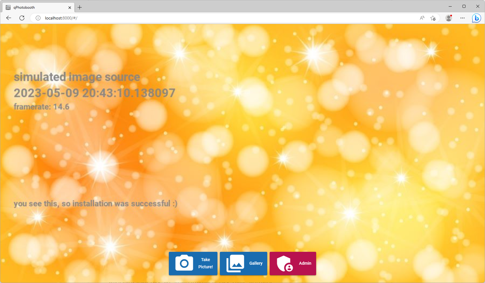
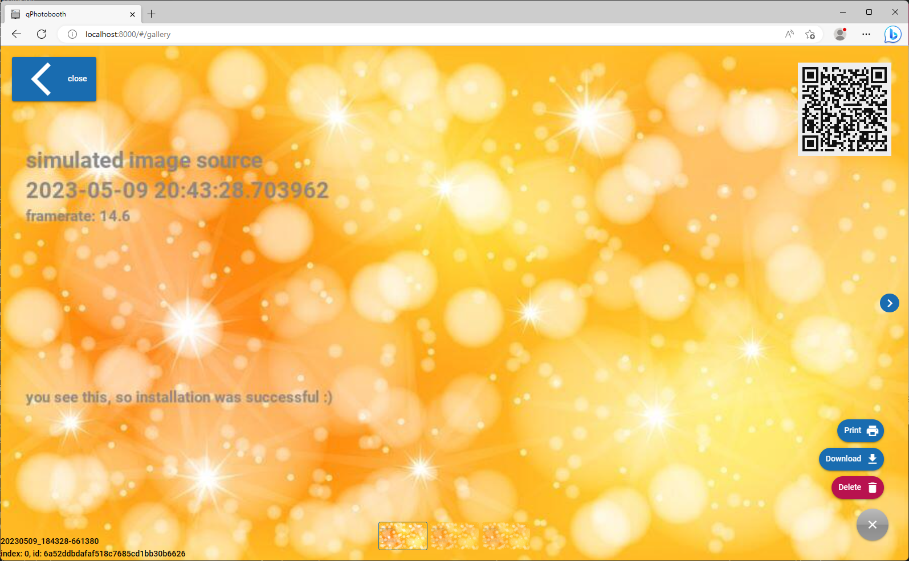
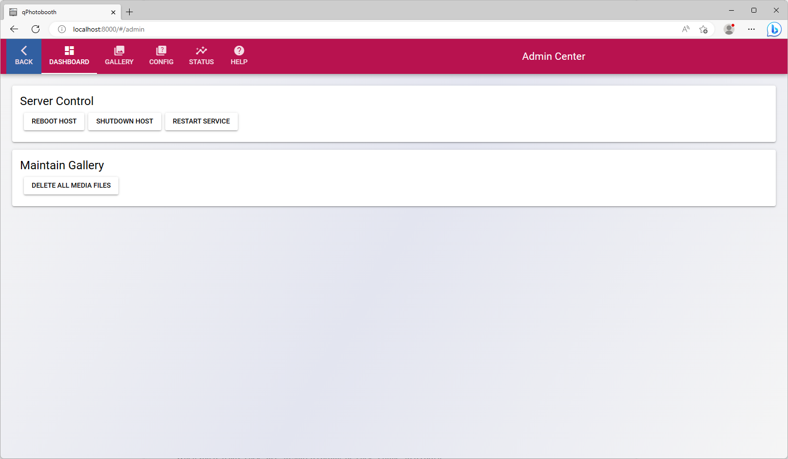
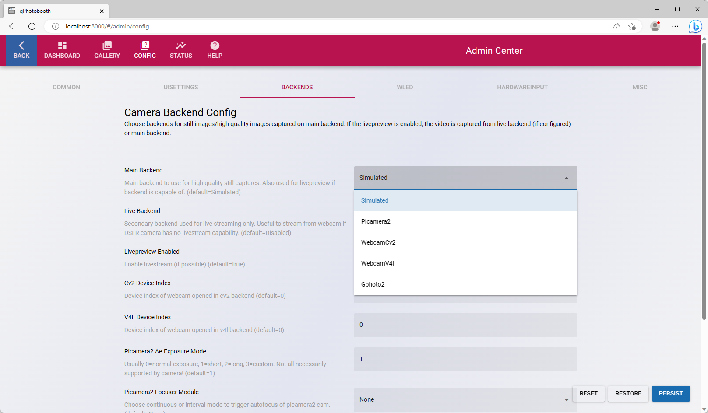
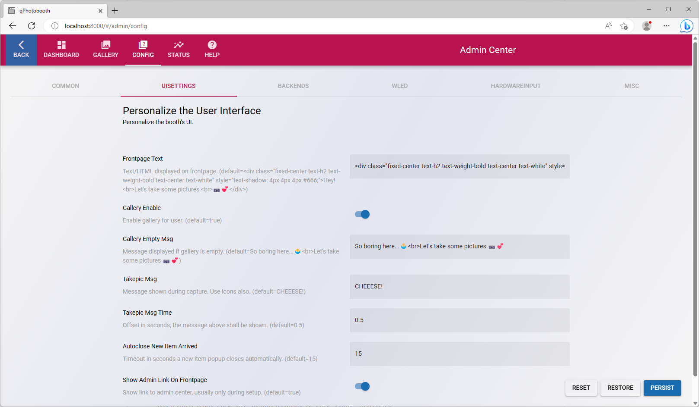
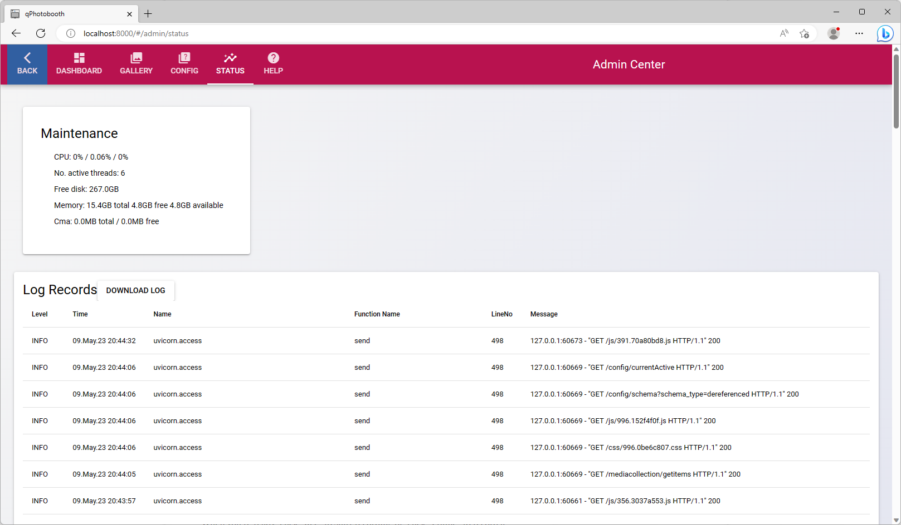

# Photobooth App


[](https://github.com/mgrl/photobooth-app/actions/workflows/ruff.yml)
[](https://github.com/mgrl/photobooth-app/actions/workflows/pytests.yml)
[](https://codecov.io/gh/mgrl/photobooth-app)

The photobooth app is written in Python 🐍 and coming along with a modern Vue frontend.

---

**[Features](#-features)** - **[Supported Cameras](#-supported-cameras)** - **[Installation](#-installation)** - **[Documentation](https://mgrl.github.io/photobooth-docs/)**

## 😍 Features

- 📹 camera live preview with shortest delay as possible, permanent video live view in background
- ⚡️ optimized for speed, live stream hardware accelerated on rpi, cpu load < 20%
- 🫶 several camera backends supported for high quality stills and livestream
- 💡 WLED support signaling photo countdown and feedback to the user when the photo is actually taken
- 🤝 Linux 🐧, Raspberry Pi 🍓 and Windows 🪟 platforms supported

## 📷 Supported Cameras

The photobooth app's Python backend allows to use different camera types on Linux and Windows platforms:

- Raspberry Pi Camera Module 1/2/3 (with or without autofocus)
- Arducam cameras (with or without autofocus)
- DSLR camera via
  - gphoto2, Linux
  - digicamcontrol, Windows (not yet implemented)
- webcams (via opencv2 or v4l)

The app controls camera's autofocus, handles led signaling when a photo is taken and streams live video to photobooth.

The booth is made from 3d printed parts, [see the documentation ✍ over here](https://github.com/mgrl/photobooth-3d).
The camera support is mostly ready to use, the frontend is not production ready yet.
Use [photobooth project](https://photoboothproject.github.io/) as frontend.

## 💅 Screenshots









## 🔧 Installation

### Prerequisites

- Python 3.9 or later
- Camera, can be one or two (first camera for stills, second camera for live view)
  - DSLR: [gphoto2](https://github.com/gonzalo/gphoto2-updater) on linx
  - Picamera2: installed and working (test with `libcamera-hello`)
  - Webcamera: no additional prerequisites, ensure camera is working using native system apps
- Raspberry Pi Bullseye for Picamera2 or any other linux/windows system
- Turbojpeg (via apt on linux, manually install on windows)
- [works probably best with 3d printed photobooth and parts listed in the BOM](https://github.com/mgrl/photobooth-3d)

The photobooth app can be used standalone but is not feature complete yet.
Anyway, it integrates well with the fully blown [photobooth project](https://photoboothproject.github.io/),
see description below how to achieve integration.

### Install via pip

On a fresh Raspberry Pi OS 64bit, run following commands:

```sh
sudo apt-get update
sudo apt-get upgrade # system should be up to date

# install some system dependencies
sudo apt-get -y install libturbojpeg0 python3-pip libgl1 python3-picamera2

# add user to input group for keyboard events
usermod --append --groups tty,input {USERNAME}

# install app
pip install photobooth-app
```

Start the app and browse to <http://localhost:8000>.

```sh
photobooth # photobooth should be available globally. if file is not found check PATH
```

### Integrate Photobooth-Project and this Photobooth-App

Following commands have to be set in photobooth project to use this app as streamingserver.
Replace <http://photobooth> by the actual hostname or localhost if on same server.

```text
take_picture_cmd: curl -o "%s" localhost:8000/aquisition/still | echo Done
take_picture_msg: Done
pre_photo_cmd: curl http://photobooth:8000/aquisition/mode/capture
post_photo_cmd: curl http://photobooth:8000/aquisition/mode/preview
preview_url: url("http://photobooth:8000/aquisition/stream.mjpg")
background_defaults: url("http://photobooth:8000/aquisition/stream.mjpg")
```

## 📣 Changelog

see separate file:
<https://github.com/mgrl/photobooth-app/blob/main/LICENSE.md>

### ©️ License

The software is licensed under the MIT license.  

### 🎉 Donation

If you like my work and like to keep me motivated you can buy me a coconut water:

[](https://www.paypal.com/donate/?hosted_button_id=8255Y566TBNEC)
